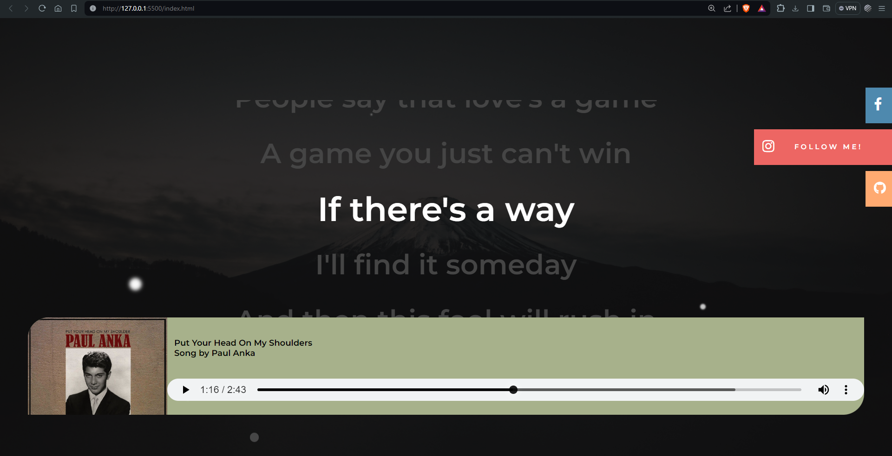

# Html Music With Lyrics

<h1>Music Player </h1>

<p>This Music Player is allows you to play music with lyrics  .</p>

<h3>Used Technologies</h3>
<ul>
    <li>HTML5</li>
    <li>CSS3</li>
    <li>JavaScript</li>
</ul>

#### Steps to Use:

---

- Download or clone the repository

```
git clone https://github.com/UDAIBHAT/Web_Music_Player.git
```

- Go to the directory
- Run the index.html file
- Start Listening!!!



<h3> Live Link </h3>

<a href="https://udaibhat.github.io/Web_Music_Player/"> click it! </a>

<br>
